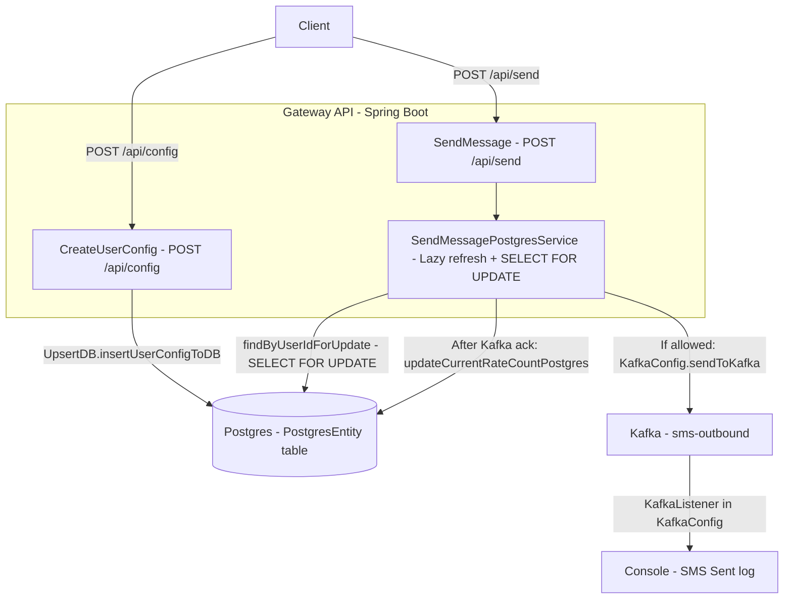
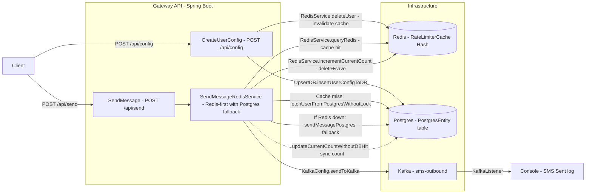
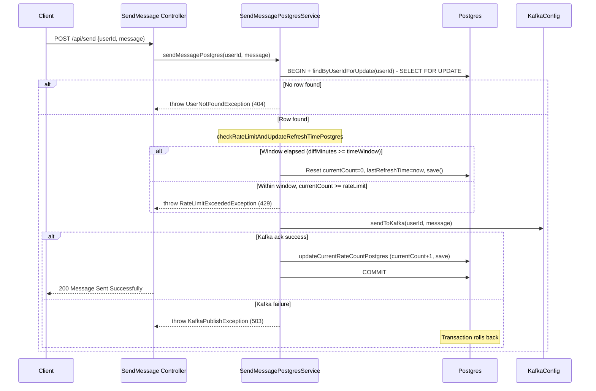
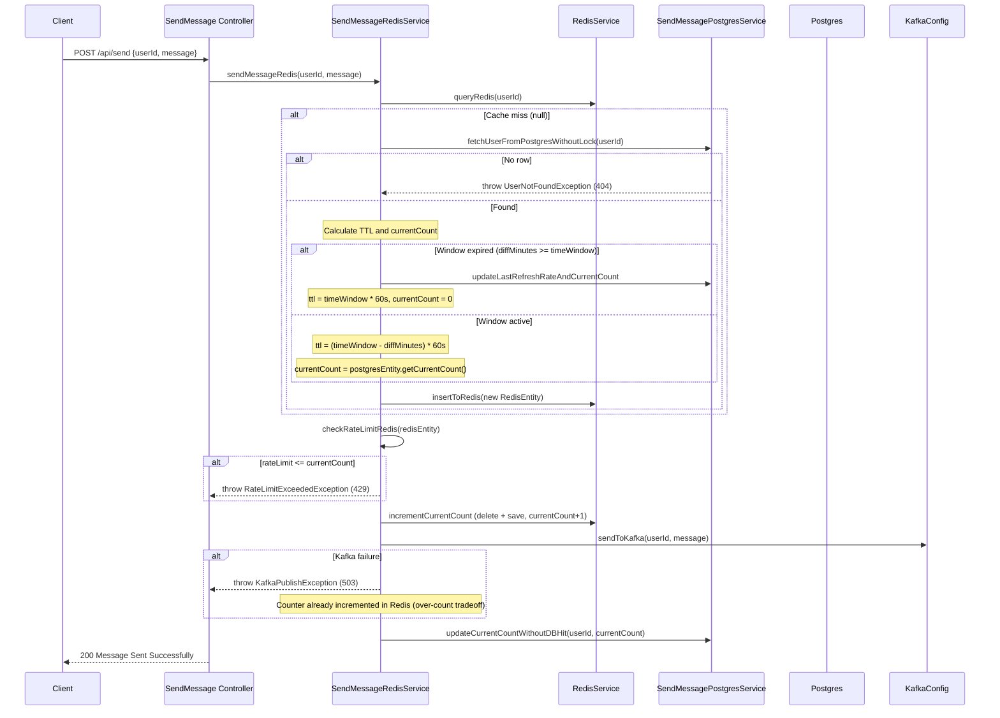
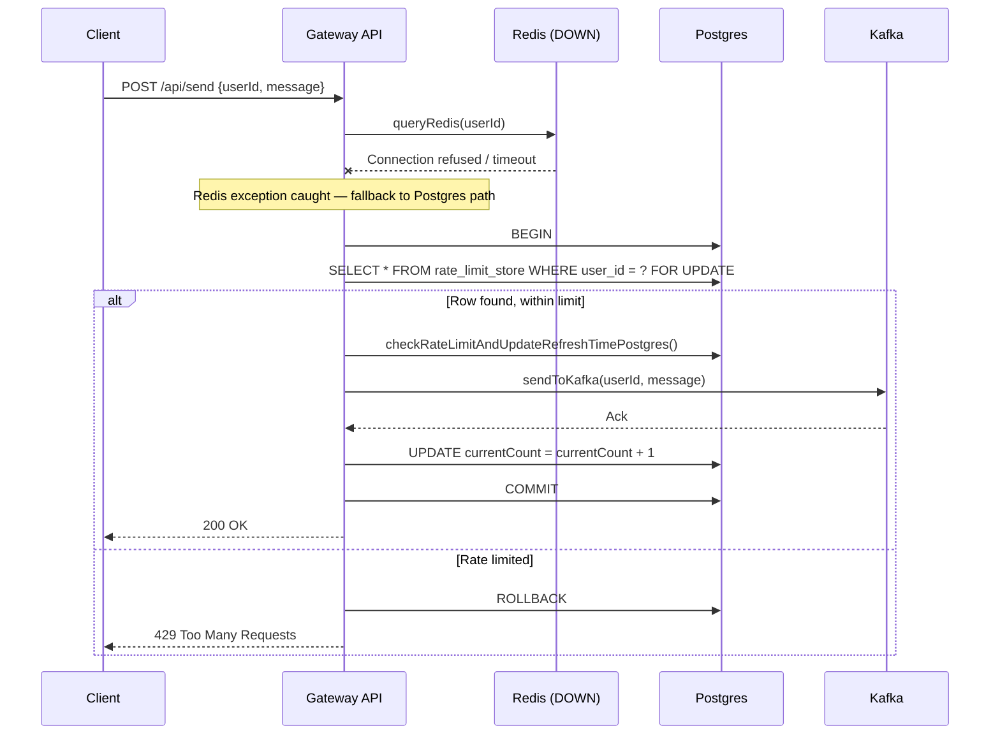

# Design Document: Rate-Limited Notification Gateway

## Overview

A concurrency-safe, rate-limited SMS notification gateway built with Spring Boot (Java 21), Kafka, Postgres, and Redis. The system exposes a REST API for configuring per-user rate limits and sending SMS notifications. Rate limiting uses a single Postgres table (`PostgresEntity`) with a lazy refresh pattern — counters reset inline on the send path when the time window elapses, with no background jobs.

The architecture follows a phased approach:
- **Phase 1**: Postgres-backed rate limiting with `SELECT ... FOR UPDATE` row-level locking, Kafka event publishing to `sms-outbound`, a Sender Service consumer (in-process `@KafkaListener`), and Docker Compose orchestration.
- **Phase 2**: Adds a Redis caching layer using `@RedisHash("RateLimiterCache")` with `CrudRepository`. Redis stores a single Hash per user at key `RateLimiterCache:{userId}` containing `rateLimit`, `currentCount`, and a `@TimeToLive` TTL (in seconds). On cache miss, the system queries Postgres and populates Redis. Postgres remains the source of truth. Atomic Lua script operations are deferred to future scope.

Key design decisions:
- Single table combining config and counters avoids joins and simplifies the transactional boundary.
- Lazy refresh eliminates background schedulers and clock-drift issues.
- Phase 1: `current_count` is incremented only after Kafka publish confirmation, preventing phantom counts.
- Phase 2: Redis increments counter BEFORE Kafka publish — deliberate over-count tradeoff (safety over accuracy).
- Java 21 Virtual Threads (`spring.threads.virtual.enabled=true`) for high-throughput I/O-bound request handling.
- Java Records for all DTOs (nested inside `AllRecords` class).
- `userId` is `int` throughout the entire system (entity, DTOs, repository, endpoints).
- No interfaces — concrete `@Component` classes with constructor injection.
- `@RestControllerAdvice` (`GlobalExceptionRepository`) handles all exceptions; no try-catch in service layer.

## Dependencies

### Gateway API (Spring Initializr)

| Dependency | Purpose |
|------------|---------|
| Spring Web | REST endpoints (`/api/config`, `/api/send`) |
| Spring Data JPA | Postgres access, `@Lock(PESSIMISTIC_WRITE)`, repositories |
| PostgreSQL Driver | JDBC driver for Postgres |
| Spring for Apache Kafka | Kafka producer + in-process consumer for `sms-outbound` topic |
| Validation | `@Valid`, `@Min`, `@NotBlank` on request DTOs |
| Lombok | `@Data`, `@NoArgsConstructor`, `@AllArgsConstructor`, `@Getter` |
| Spring Data Redis | `@RedisHash`, `CrudRepository`, `@TimeToLive` for Redis caching |

### Manual Additions (pom.xml — test scope, currently commented out)

| Dependency | Coordinates | Purpose |
|------------|-------------|---------|
| jqwik | `net.jqwik:jqwik:1.9.2` | Property-based testing |
| TestContainers PostgreSQL | `org.testcontainers:postgresql` | Postgres container for integration tests |
| TestContainers Kafka | `org.testcontainers:kafka` | Kafka container for integration tests |
| TestContainers JUnit 5 | `org.testcontainers:junit-jupiter` | JUnit 5 integration for TestContainers |
| TestContainers Redis | `org.testcontainers:redis` | Redis container for Phase 2 integration tests |

### Project Settings

- Java version: **21**
- Spring Boot: **3.2+** (latest 3.x for Virtual Threads support)
- `spring.threads.virtual.enabled=true` in `application.properties`
- `spring.jpa.hibernate.ddl-auto=update` (auto-creates table from entity)

## Architecture

### System Architecture (Phase 1)



### System Architecture (Phase 2)



### Send Path Flow (Phase 1 — Postgres with Lazy Refresh)



### Send Path Flow (Phase 2 — Redis Hot Path)


## System Flow on Redis Failure

When Redis becomes unavailable (crash, network partition, timeout), the system degrades gracefully without dropping requests or bypassing rate limits. The fallback path reuses the Phase 1 Postgres-backed logic entirely.

### Detection

- The `SendMessage` controller wraps the `sendMessageRedis()` call in a try-catch for Redis exceptions (`RedisConnectionFailureException`, `RedisCommandTimeoutException`, or any `DataAccessException` from Redis operations).
- On any Redis exception, the controller logs a `WARN`-level message and delegates immediately to `sendMessagePostgres()`.
- No circuit breaker is needed initially — the try-catch fallback is sufficient. A circuit breaker (e.g., Resilience4j) can be added later if Redis flapping causes latency spikes from repeated connection attempts.

### Fallback Flow



### Behavior During Redis Outage

| Aspect | Behavior |
|--------|----------|
| Config cache | Bypassed — config fetched directly from Postgres via `findByUserIdForUpdate` |
| Rate limit check | Uses `SELECT ... FOR UPDATE` (Phase 1 path) with lazy refresh |
| Counter increment | Inside Postgres transaction, after Kafka ack |
| Throughput | Reduced for same-user bursts (Postgres row lock serializes requests) |
| Correctness | Fully preserved — no requests bypass the limit |
| User experience | Slightly higher latency for same-user bursts; different-user requests unaffected |

### Recovery

When Redis comes back online:
- The next `sendMessageRedis()` call succeeds, and the hot path resumes automatically.
- Redis keys may have expired during the outage, so the first request triggers a cache miss → Postgres fetch → Redis populate cycle. This self-heals without manual intervention.
- The async Postgres sync (`updateCurrentCountWithoutDBHit`) continues to keep the source of truth accurate regardless of Redis state.

### Config Update During Redis Outage

If `/api/config` is called while Redis is down:
- Postgres upsert succeeds normally via `UpsertDB.insertUserConfigToDB()`.
- `RedisService.deleteUser(userId)` fails silently (logged as `WARN`).
- The stale cache entry expires naturally via TTL, or is absent entirely if Redis restarts clean.
- No data inconsistency risk — Postgres is always the source of truth.


## Components (Actual Codebase)

### Package Structure

```
com.example.RateLimitedSMSGateway/
├── Endpoints/
│   ├── CreateUserConfig.java      — POST /api/config controller
│   └── SendMessage.java           — POST /api/send controller
├── Entity/
│   ├── PostgresEntity.java        — JPA entity (@Entity, @Table)
│   └── RedisEntity.java           — Redis entity (@RedisHash)
├── Repository/
│   ├── PostgresRepository.java    — JpaRepository with @Lock and @Modifying
│   └── RedisRepository.java       — CrudRepository<RedisEntity, Integer>
├── Services/
│   ├── UpsertDB.java              — Config upsert logic (insert or update)
│   ├── SendMessagePostgresService.java — Phase 1 send path (SELECT FOR UPDATE)
│   ├── SendMessageRedisService.java    — Phase 2 send path (Redis-first)
│   ├── RedisService.java          — Redis CRUD operations
│   └── KafkaConfig.java           — Kafka producer + @KafkaListener consumer
├── CustomExceptions/
│   ├── CustomExceptionTemplate.java    — Base exception (message + statusCode)
│   ├── UserNotFoundException.java      — 404
│   ├── RateLimitExceededException.java — 429
│   ├── KafkaPublishException.java      — 503
│   └── GlobalExceptionRepository.java  — @RestControllerAdvice handler
└── DTO/
    └── AllRecords.java            — Nested Java Records for all DTOs
```

### REST Endpoints

**POST `/api/config`** — `CreateUserConfig` controller

Request body (JSON):
```json
{
  "userId": 101,
  "rateLimit": 10,
  "timeWindow": 5
}
```

| Status | Body | Condition |
|--------|------|-----------|
| 200 | `RespondCreateUserConfig` record | Success (insert or update) |
| 400 | `"Missing/Invalid Arguments"` | `@Valid` fails (`@Min` on userId/rateLimit/timeWindow) |
| 503 | `"Postgres Down : Service Unavailable"` | `DataAccessException` caught by `GlobalExceptionRepository` |

Behavior:
1. `UpsertDB.insertUserConfigToDB(userId, rateLimit, timeWindow)` — upserts Postgres row with `currentCount=0`, `lastRefreshTime=now()`
2. `RedisService.deleteUser(userId)` — invalidates Redis cache (wrapped in try-catch; if Redis down, logs and continues)
3. Returns `RespondCreateUserConfig` record with all fields

**POST `/api/send`** — `SendMessage` controller

Request body (JSON):
```json
{
  "userId": 101,
  "message": "Hello World"
}
```

| Status | Body | Condition |
|--------|------|-----------|
| 200 | `"Message Sent Successfully"` | Allowed and published to Kafka |
| 400 | `"Missing/Invalid Arguments"` | `@Valid` fails |
| 404 | `"User Not Found"` | No config for userId |
| 429 | `"Rate Limit Exceeded"` | Rate limit reached |
| 503 | `"Kafka Down : Service Unavailable"` | Kafka unreachable |

Behavior:
1. Try `SendMessageRedisService.sendMessageRedis(userId, message)` (Phase 2 Redis path)
2. Catch `RedisConnectionFailureException | RedisCommandTimeoutException | RedisSystemException` → log "REDIS DOWN — Falling back to Postgres" → call `SendMessagePostgresService.sendMessagePostgres(userId, message)` (Phase 1 path)
3. All other exceptions propagate to `GlobalExceptionRepository`

### Data Models

#### PostgresEntity (JPA Entity)

```java
@Data @Entity @NoArgsConstructor
@Table(name = "PostgresEntity")
public class PostgresEntity {
    @Id @Column(name = "userId")
    private int userId;

    @Column(name = "rateLimit", nullable = false)
    private int rateLimit;

    @Column(name = "timeWindow", nullable = false)
    private int timeWindow;

    @Column(name = "currentCount", nullable = false)
    private int currentCount;

    @Column(name = "lastRefreshTime", nullable = false)
    private Instant lastRefreshTime;

    public PostgresEntity(int userId, int rateLimit, int timeWindow) {
        this.userId = userId;
        this.rateLimit = rateLimit;
        this.timeWindow = timeWindow;
        this.currentCount = 0;
        this.lastRefreshTime = Instant.now();
    }
}
```

- Table name: `PostgresEntity` (not snake_case)
- Column names: camelCase (`userId`, `rateLimit`, `timeWindow`, `currentCount`, `lastRefreshTime`)
- `userId` is `int` (not String)
- `ddl-auto=update` auto-creates the table from the entity

#### RedisEntity (@RedisHash)

```java
@Data @AllArgsConstructor @NoArgsConstructor
@RedisHash(value = "RateLimiterCache")
public class RedisEntity {
    @Id @Indexed
    private int userId;

    private int rateLimit;
    private int currentCount;

    @TimeToLive
    private long ttl;  // in seconds
}
```

- Redis key pattern: `RateLimiterCache:{userId}`
- `@TimeToLive` field `ttl` is in seconds — Redis auto-deletes the Hash when TTL expires
- TTL calculation: window expired → `timeWindow * 60`; window active → `(timeWindow - diffMinutes) * 60`

### Repositories

#### PostgresRepository

```java
@Repository
public interface PostgresRepository extends JpaRepository<PostgresEntity, Integer> {
    @Lock(LockModeType.PESSIMISTIC_WRITE)
    @Query("SELECT r FROM PostgresEntity r WHERE r.userId = :userId")
    Optional<PostgresEntity> findByUserIdForUpdate(@Param("userId") int userId);

    @Modifying
    @Query("UPDATE PostgresEntity r SET r.currentCount=:currentCount WHERE r.userId=:userId")
    void updateCurrentCountWithoutDBHit(@Param("userId") int userId, @Param("currentCount") int currentCount);
}
```

- `findByUserIdForUpdate` — Phase 1 send path, acquires row-level lock
- `updateCurrentCountWithoutDBHit` — Phase 2 Postgres sync, direct JPQL UPDATE without SELECT

#### RedisRepository

```java
@Repository
public interface RedisRepository extends CrudRepository<RedisEntity, Integer> {}
```

### Service Layer

#### UpsertDB — Config persistence

- `insertUserConfigToDB(int userId, int rateLimit, int timeWindow)` → `PostgresEntity`
- Checks `findById(userId)`: if present, updates fields and resets `currentCount=0`, `lastRefreshTime=now()`; if absent, creates new entity via custom constructor
- Exceptions propagate to `GlobalExceptionRepository` (`DataAccessException` → 503)

#### SendMessagePostgresService — Phase 1 send path

- `sendMessagePostgres(int userId, String message)` — `@Transactional`, uses `findByUserIdForUpdate` (SELECT FOR UPDATE)
  1. Fetch row with lock → `UserNotFoundException` if not found
  2. `checkRateLimitAndUpdateRefreshTimePostgres`: lazy refresh check
     - If `diffMinutes >= timeWindow` → reset `currentCount=0`, `lastRefreshTime=now()`, save
     - Else if `currentCount >= rateLimit` → throw `RateLimitExceededException`
  3. `KafkaConfig.sendToKafka(userId, message)` → `KafkaPublishException` on failure
  4. `updateCurrentRateCountPostgres` → `currentCount+1`, save (only after Kafka ack)
- `fetchUserFromPostgresWithoutLock(int userId)` — `findById` (no lock), throws `UserNotFoundException` if not found. Used by Redis path for cache miss.
- `updateLastRefreshRateAndCurrentCount(PostgresEntity, Instant)` — resets `lastRefreshTime` and `currentCount=0`, save. Used by Redis path when window expired on cache miss.
- `updateCurrentCountWithoutDBHit(int userId, int currentCount)` — `@Transactional`, calls `PostgresRepository.updateCurrentCountWithoutDBHit`. Direct JPQL UPDATE, no SELECT. Used by Redis path for Postgres sync.

#### SendMessageRedisService — Phase 2 send path

- `sendMessageRedis(int userId, String message)`:
  1. `RedisService.queryRedis(userId)` — cache hit returns `RedisEntity`, miss returns `null`
  2. On cache miss:
     - `fetchUserFromPostgresWithoutLock(userId)` — get Postgres row (no lock)
     - Calculate `diffMinutes` between `lastRefreshTime` and now
     - If `diffMinutes >= timeWindow`: reset Postgres (`updateLastRefreshRateAndCurrentCount`), `ttl = timeWindow * 60`, `currentCount = 0`
     - If `diffMinutes < timeWindow`: `ttl = (timeWindow - diffMinutes) * 60`, `currentCount = postgresEntity.getCurrentCount()`
     - `RedisService.insertToRedis(new RedisEntity(userId, rateLimit, currentCount, ttl))`
  3. `checkRateLimitRedis(redisEntity)` — if `rateLimit <= currentCount`, throw `RateLimitExceededException`
  4. `RedisService.incrementCurrentCount(redisEntity)` — delete + save with `currentCount+1` (NOT atomic)
  5. `KafkaConfig.sendToKafka(userId, message)` — counter already incremented (over-count tradeoff)
  6. `updateCurrentCountWithoutDBHit(userId, redisEntity.getCurrentCount())` — sync to Postgres

#### RedisService — Redis CRUD operations

- `insertToRedis(RedisEntity)` → `CrudRepository.save()`
- `queryRedis(int userId)` → `CrudRepository.findById()`, returns `null` on miss
- `incrementCurrentCount(RedisEntity)` → set `currentCount+1`, `deleteById`, `save` (not atomic — race condition possible under high concurrency)
- `deleteUser(int userId)` → `CrudRepository.deleteById()`

#### KafkaConfig — Kafka producer + consumer

- `sendToKafka(int userId, String message)` — synchronous send via `kafkaTemplate.send(...).get()`, throws `KafkaPublishException` on failure
- `@KafkaListener(id = "myId", topics = "sms-outbound")` — in-process consumer, logs `"SMS Sent: " + message`
- `@Bean NewTopic topic()` — creates `sms-outbound` topic with 4 partitions, 1 replica

### Custom Exception Hierarchy

```
RuntimeException
└── CustomExceptionTemplate (message: String, statusCode: int)
    ├── UserNotFoundException       → 404 "User Not Found"
    ├── RateLimitExceededException  → 429 "Rate Limit Exceeded"
    └── KafkaPublishException       → 503 "Kafka Down : Service Unavailable"
```

### GlobalExceptionRepository (@RestControllerAdvice)

| Exception | HTTP Status | Response Body |
|-----------|-------------|---------------|
| `CustomExceptionTemplate` | `exc.getStatusCode()` | `exc.getMessage()` |
| `DataAccessException` | 503 | `"Postgres Down : Service Unavailable"` |
| `MethodArgumentNotValidException` | 400 | `"Missing/Invalid Arguments"` |
| `Exception` (catch-all) | 500 | `"Internal Server Error"` |

### DTOs (Java Records in AllRecords.java)

```java
public class AllRecords {
    public record RateLimitConfigRequest(
        @Min(0) int userId,
        @Min(1) int rateLimit,
        @Min(1) int timeWindow
    ) {}

    public record RespondCreateUserConfig(
        int userId, int rateLimit, int timeWindow,
        int currentCount, Instant lastRefreshTime
    ) {}

    public record SendRequest(
        @Min(0) int userId,
        @NotBlank String message
    ) {}
}
```

### Kafka Message Format

Topic: `sms-outbound`, 4 partitions, 1 replica

Key: not explicitly set (default partitioning)

Value: `"{userId}: {message}"` (plain string, not JSON)

### Docker Compose Services

| Service | Image | Port | Health Check |
|---------|-------|------|-------------|
| app (Gateway API) | Built from Dockerfile | 8080 | depends_on kafka, postgres, redis |
| zookeeper | confluentinc/cp-zookeeper:7.5.0 | 2181 | — |
| kafka | confluentinc/cp-kafka:7.5.0 | 9092, 29092 | `nc -z localhost 9092` |
| postgres | postgres:15-alpine | 5432 | `pg_isready` |
| redis | redis:8.0.6-alpine3.21 | 6379 | `redis-cli ping` |

Network: `RateLimitedSMSGatewayNETWORK` (bridge driver)

## Locking Strategy: Phase 1 vs Phase 2

### Phase 1: Postgres Row Lock Held Across Kafka Call

In Phase 1, the `SELECT ... FOR UPDATE` row lock is held for the entire send path — from reading the row through the Kafka publish to `COMMIT`. The rate limit decision and counter increment must be atomic.

```
Request A (user_id=101, 1 slot left):
  BEGIN
  SELECT ... FOR UPDATE  ← acquires row lock
  Check: currentCount(9) < rateLimit(10) → allowed
  sendToKafka ... waiting for ack ... (5-50ms)
  Kafka ack received
  UPDATE currentCount = 10, save()
  COMMIT ← releases row lock

Request B (same user, arrives during Request A):
  BEGIN
  SELECT ... FOR UPDATE  ← BLOCKED waiting for Request A lock
  ... waiting ...
  ... Request A commits, lock released ...
  Row now shows currentCount=10
  Check: currentCount(10) >= rateLimit(10) → DENIED
  throw RateLimitExceededException
  → 429 Too Many Requests
```

Lock duration = DB read + Kafka round-trip + DB write. Acceptable because:
- Lock is per-user row, not table-wide — different users are fully parallel
- Kafka acks are typically fast (single-digit ms in a healthy cluster)
- Virtual Threads mean blocked requests don't consume OS threads while waiting

### Phase 2: Redis Eliminates the Lock-Across-Kafka Problem

Redis changes the game because the rate limit check and counter increment happen via `CrudRepository` operations (sub-millisecond), independent of the Kafka publish. No Postgres lock is held.

```
Request A (user_id=101, 1 slot left):
  queryRedis(101) → RedisEntity{currentCount=9, rateLimit=10}
  checkRateLimitRedis → 10 <= 9? No → allowed
  incrementCurrentCount → delete + save → currentCount=10
  sendToKafka (no lock held)
  updateCurrentCountWithoutDBHit(101, 10) → sync to Postgres
  → 200 OK

Request B (same user, arrives 0.2ms later):
  queryRedis(101) → RedisEntity{currentCount=10, rateLimit=10}
  checkRateLimitRedis → 10 <= 10? Yes → DENIED
  throw RateLimitExceededException
  → 429 Too Many Requests
```

**Note**: The current `CrudRepository` approach (delete + save) is NOT atomic. Under high concurrency for the same user, two requests could read `currentCount=9` before either increments. This is acceptable for low-concurrency scenarios. Lua script atomicity (future scope) eliminates this race condition.

### Comparison

| Aspect | Phase 1 (Postgres) | Phase 2 (Redis CrudRepository) |
|--------|-------------------|-------------------------------|
| Lock duration | DB read + Kafka RTT + DB write | No lock (CrudRepository ops) |
| Concurrent same-user requests | Serialized (blocked on row lock) | Parallel (race condition possible) |
| Kafka publish | Inside lock (blocks others) | Outside lock (non-blocking) |
| Counter increment | After Kafka ack, inside transaction | Before Kafka publish (over-count tradeoff) |
| Failure handling | ROLLBACK undoes everything cleanly | Counter already incremented; Kafka fail = over-counted |
| Postgres sync | Real-time (same transaction) | Async via updateCurrentCountWithoutDBHit |
| Atomicity | Full (SELECT FOR UPDATE) | Not atomic (future: Lua script) |

### Phase 2 Tradeoff: Counter Increment Before Kafka

Redis increments the counter BEFORE Kafka publish. If Kafka fails, the counter is already incremented (over-counted). This is deliberate:
- Over-counting (slightly more restrictive on rare Kafka failures) is safer than under-counting (allowing limit bypass)
- A compensating decrement would create a race condition window where concurrent requests could bypass the rate limit
- The user loses one rate limit slot for a message that was never sent — acceptable tradeoff

## Correctness Properties

### Property 1: Config persistence round trip

For any valid userId (>= 0), rateLimit (> 0), and timeWindow (> 0), posting to `/api/config` returns HTTP 200 and the persisted row has `currentCount = 0` and `lastRefreshTime` approximately equal to now. Must hold for both inserts and updates.

**Validates: Requirements 1.1, 1.3**

### Property 2: Invalid config rejection

For any POST to `/api/config` where at least one field fails `@Valid` (e.g., rateLimit < 1, timeWindow < 1), the Gateway API returns HTTP 400 and the `PostgresEntity` table remains unchanged.

**Validates: Requirements 1.2**

### Property 3: Lazy refresh resets counter on window expiry

For any user whose `lastRefreshTime + timeWindow <= now`, a send request succeeds (HTTP 200), resets `currentCount` to 1, and updates `lastRefreshTime` — regardless of previous `currentCount`.

**Validates: Requirements 2.2**

### Property 4: Rate limit enforcement within active window

For any user within their active window (`diffMinutes < timeWindow`), send returns HTTP 200 iff `currentCount < rateLimit`. If `currentCount >= rateLimit`, returns HTTP 429 and count remains unchanged.

**Validates: Requirements 2.3, 2.4**

### Property 5: Count increment only after Kafka confirmation (Phase 1)

For any send request passing the rate limit check in Phase 1, if Kafka publish fails, `currentCount` must not be incremented and Gateway returns HTTP 503 (via `KafkaPublishException`).

**Validates: Requirements 2.6, 4.2, 4.3**

### Property 6: Concurrency safety — exactly one wins (Phase 1)

For any user with exactly 1 slot remaining, if N concurrent requests arrive via the Postgres path, exactly 1 succeeds (HTTP 200) and N-1 are rejected (HTTP 429). Final `currentCount` equals `rateLimit`. Guaranteed by `SELECT ... FOR UPDATE`.

**Validates: Requirements 3.2**

### Property 7: Kafka message correctness

For any successful send request (HTTP 200), a message on `sms-outbound` contains the userId and message payload from the original request.

**Validates: Requirements 4.1**

### Property 8: Sender Service log output

For any valid message consumed from `sms-outbound`, the `@KafkaListener` logs a message containing "SMS Sent" and the message content.

**Validates: Requirements 5.2**

### Property 9: Redis cache-first with miss-populate (Phase 2)

For any send request in Phase 2, if Redis contains `RateLimiterCache:{userId}`, the system uses it without querying Postgres. On cache miss, the system fetches from Postgres (no lock), calculates TTL, and populates Redis. The rate limiting decision should match what the data dictates.

**Validates: Requirements 9.1, 9.2, 10.1**

### Property 10: Config update invalidates Redis cache (Phase 2)

For any config update via `/api/config`, the Redis Hash at `RateLimiterCache:{userId}` is deleted, so the next send request triggers a cache miss and fetches fresh state from Postgres.

**Validates: Requirements 9.3**

### Property 11: Redis fallback to Postgres (Phase 2)

When Redis is unreachable, the `SendMessage` controller catches Redis exceptions and falls back to `sendMessagePostgres`, which uses `SELECT ... FOR UPDATE` for full concurrency safety. No requests bypass the rate limit due to Redis being down.

**Validates: Requirements 10.5, 11.5**

## Error Handling Summary

### Send Path Error Flow

```
SendMessage Controller
├── try: sendMessageRedisService.sendMessageRedis()
│   ├── RedisService.queryRedis() → cache hit or miss
│   ├── Cache miss → fetchUserFromPostgresWithoutLock()
│   │   └── Not found → UserNotFoundException (404)
│   ├── checkRateLimitRedis() → RateLimitExceededException (429)
│   ├── incrementCurrentCount() → Redis ops
│   ├── sendToKafka() → KafkaPublishException (503)
│   └── updateCurrentCountWithoutDBHit() → Postgres sync
├── catch Redis exceptions → fallback to sendMessagePostgres()
│   ├── findByUserIdForUpdate() → UserNotFoundException (404)
│   ├── checkRateLimitAndUpdateRefreshTimePostgres() → RateLimitExceededException (429)
│   ├── sendToKafka() → KafkaPublishException (503)
│   └── updateCurrentRateCountPostgres() → save
└── All exceptions → GlobalExceptionRepository (@RestControllerAdvice)
```

### Transaction Behavior

- Phase 1 (`sendMessagePostgres`): `@Transactional` — if `KafkaPublishException` is thrown, the entire transaction rolls back. `currentCount` is never incremented for failed Kafka publishes.
- Phase 2 (`sendMessageRedis`): No `@Transactional` on the Redis path. Redis increment happens before Kafka. If Kafka fails, Redis counter is already incremented (over-count). Postgres sync via `updateCurrentCountWithoutDBHit` is a separate `@Transactional` call.

## Testing Strategy

### Dual Testing Approach

- **Unit tests**: Verify specific examples, edge cases, error conditions.
- **Property-based tests (jqwik)**: Verify universal properties across randomly generated inputs.

### Property-Based Testing Configuration

- Library: [jqwik](https://jqwik.net/) — property-based testing engine for JUnit 5
- Minimum iterations: 100 per property test (`@Property(tries = 100)`)
- Tag format: `// Feature: rate-limited-notification-gateway, Property N: ...`

### Integration Tests (TestContainers)

- `@Testcontainers` with Postgres, Kafka, Redis containers
- Full flow: configure → send up to limit → verify 429 → wait for window → verify reset
- Concurrency: configure limit=1, fire N parallel requests, assert exactly 1 succeeds
- Kafka failure: stop Kafka container, verify 503 and count unchanged
- Redis fallback: stop Redis container, verify Postgres path works
- Cache invalidation: update config, verify Redis entry deleted

### Property Test to Requirement Mapping

| Property | Requirements |
|----------|-------------|
| 1: Config round trip | 1.1, 1.3 |
| 2: Invalid config rejection | 1.2 |
| 3: Lazy refresh reset | 2.2 |
| 4: Rate limit enforcement | 2.3, 2.4 |
| 5: Count after Kafka failure | 2.6, 4.2, 4.3 |
| 6: Concurrency exactly-one | 3.2 |
| 7: Kafka message content | 4.1 |
| 8: Sender log output | 5.2 |
| 9: Redis cache-first + populate | 9.1, 9.2, 10.1 |
| 10: Cache invalidation | 9.3 |
| 11: Redis fallback | 10.5, 11.5 |


## Future Scopes and Learning Resources

### 1. Atomicity with Redis Lua Scripts

The current Phase 2 implementation uses `CrudRepository` operations (delete + save) for counter increment, which is NOT atomic. Two concurrent requests could read the same `currentCount` before either increments. Lua scripts solve this.

**What to improve**:
- Replace the `incrementCurrentCount` (delete + save) with an atomic `EVAL` Lua script that does `GET` + compare + `INCR` in a single Redis command — eliminating the race condition entirely.
- Implement sliding window rate limiting using sorted sets (`ZADD` + `ZRANGEBYSCORE` + `ZCARD`) inside Lua for smoother rate limiting without burst-at-boundary issues.
- Add an idempotent publish guard: store a request ID in Redis (via Lua) before Kafka publish; on retry, check the ID to avoid double-counting.

**Learning resources**:
- [Redis Lua scripting documentation](https://redis.io/docs/latest/develop/interact/programmability/eval-intro/) — official guide covering `EVAL`, `EVALSHA`, key/arg passing, and atomicity guarantees.
- [Redis University RU101 — Introduction to Redis Data Structures](https://university.redis.io/) — covers sorted sets and scripting patterns.
- [Stripe's rate limiter blog post](https://stripe.com/blog/rate-limiters) — real-world sliding window implementation using Redis.

### 2. TestContainers for Comprehensive Integration Testing

The current design references TestContainers as a test-scope dependency but doesn't fully leverage it yet. Expanding this:

- **Redis TestContainer**: Add `com.redis:testcontainers-redis` for Phase 2 integration tests — spin up a real Redis instance to test cache behavior, fallback logic, and the full Redis → Postgres failover path.
- **Chaos testing**: Programmatically stop/start containers mid-test to verify failover behavior (e.g., stop Redis container → verify Postgres fallback → restart Redis → verify recovery). Use `container.stop()` and `container.start()` within test methods.
- **Reusable containers**: Use `withReuse(true)` to speed up local test runs by keeping containers alive across test classes.
- **TestContainers + jqwik**: Combine property-based tests with real infrastructure — generate random user configs and send patterns, run them against real Postgres/Kafka/Redis containers for true end-to-end property verification.

**Learning resources**:
- [TestContainers Java documentation](https://java.testcontainers.org/) — official guide for JUnit 5 integration, container lifecycle, and networking.
- [TestContainers Redis module](https://java.testcontainers.org/modules/redis/) — setup and configuration for Redis containers in tests.
- [AtomicJar blog — Testing Kafka applications with TestContainers](https://www.atomicjar.com/2023/06/testing-kafka-applications-with-testcontainers/) — patterns for Kafka producer/consumer integration tests.

### 3. OpenSearch for Notification Analytics

Adding OpenSearch enables querying and visualizing notification history at scale, decoupled from the transactional path.

**What to build**:
- **Notification audit log**: Index every send attempt (success, rate-limited, failed) into OpenSearch with fields like `userId`, `timestamp`, `status`, `message`. This keeps analytics separate from the Postgres transactional path.
- **Rate limit dashboards**: Build OpenSearch Dashboards visualizations showing per-user send rates, 429 frequencies, and peak usage windows.
- **Anomaly detection**: Use OpenSearch's anomaly detection plugin to flag unusual patterns (e.g., a user suddenly hitting limits they never approached before).
- **Implementation approach**: Add a second Kafka consumer that reads from `sms-outbound` (or a dedicated `notification-events` topic) and indexes into OpenSearch. The Gateway API remains unchanged.

**Learning resources**:
- [OpenSearch documentation](https://opensearch.org/docs/latest/) — official docs covering indexing, querying, and dashboard creation.
- [Spring Data Elasticsearch (compatible with OpenSearch)](https://docs.spring.io/spring-data/elasticsearch/reference/) — Spring integration for indexing and querying.
- [OpenSearch Anomaly Detection plugin](https://opensearch.org/docs/latest/observing-your-data/ad/index/) — setup and configuration for automated anomaly detection.
